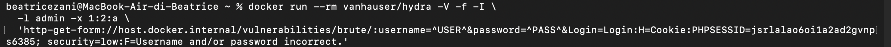
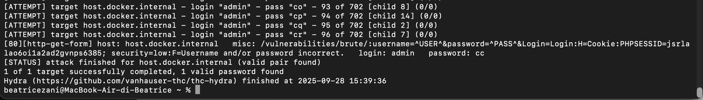
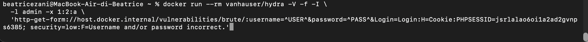
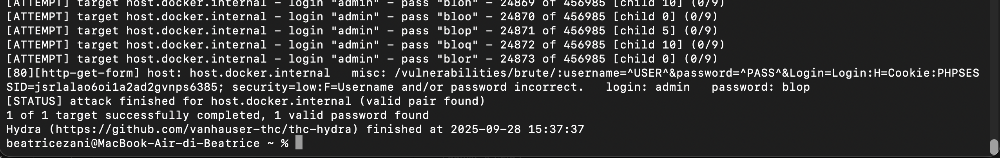

## SecurityEngineering - Week4 - Task3

### Subtask 1: Intercepting
The screenshots needed for the subtask 1 can be found in the Subtask1 folder inside the images folder.

### Subtask 2: Repeater

First I went to the DVWA Security Tab and raised the security level from Low to Medium, then generated a cookie called dvwaSession.Then I selected Send to Repeater to repeat the request as many times as I want.

When clicking Generate on the Weak Session IDs page, the server sets a cookie named dvwaSession with a numeric value. The application generates dvwaSession by using the current Unix timestamp as the session identifier. 
The Unix epoch treats time as a single running count of seconds measured from a fixed origin, which is 00:00:00 UTC on 1 January 1970. The cookie is how many whole seconds have elapsed since that origin, this value is the epoch time (or Unix timestamp).  

In my two repeats example, in DVWA I saw two cookies:

- dvwaSession=1759050336 (Sun, 28 Sep 2025 09:05:36 UTC)

- dvwaSession=1759050638 (Sun, 28 Sep 2025 09:10:38 UTC)

Even though epoch timestamps are convenient, they are very predictable since they increase by exactly one every second. Using them directly as session IDs is not secure at all, since an attacker could guess session cookies simply by knowing the approximate server time.

### Subtask 3: Intruder

I ran a Cluster Bomb attack (using 24 combinations) against the intruder with the provided payload lists and low security level as indicated. When I inspected the results I found that only two of the 24 credential combinations succeeded: admin + password and gordonb + abc123.

I identified the successful attempt by examining the raw response bodies of each different combination, and noticed that the successful ones had a bigger length: success had around 4740-4745 of length and unsuccess had 4702-4703. The examination of the responses had to be done since both success and failure responses returned HTTP 200 OK as status code.

If an attempt succeds, this message can be found in the raw response: "Welcome to the password protected area admin".

If an attempt fails, this message can be found in the response raw "Username and/or password incorrect".

I know since I used these credentials to log in, that the admin + password combination works, but I discovered that the combination gordonb + abc123 also produced a successful response. Tho understand why, I checked the DVWA files that are in the app’s user data and found the gordonb entry. In practice, the database seed contains a record for user gordonb and stores the password as MD5('abc123'). That means the app already has gordonb in its data, and it checks logins by hashing whatever password you type and comparing that hash to the stored value. So when the attack submitted abc123, the server computed MD5('abc123'), found it matched the stored hash, and logged the account in. So, gordonb is a preloaded account in the DB, and abc123 is the matching password and that is why that pair authenticated successfully.

### Subtask 4: Decoder

### Subtask 5: thc-hydra

For this subtask I used thc-hydra (via its Docker image) to automate brute-force attacks against DVWA’s Brute Force page. First I verifyied that hydra can recover the short password cc that I previously set for the admin account, and then change the admin password to a four-letter lowercase word that starts with b and have hydra discover it again.  

For the 2 letter password 'cc', I ran the following command:

The start and end time were:
- start time: Sun Sep 28 15:39:32 UTC 2025
- end time: 2025-09-28 15:39:36

So the time taken to guess the short passward was 4 seconds.  

For the 4 letter password I chose 'blop', and I ran the command by modifying the hydra command -x range, MIN=4, MAX=4 starting from first letter a. 

The start and end time were:
- start time: Sun Sep 28 14:53:11 UTC 2025
- end time: 2025-09-28 15:37:37

So the time taken to guess the short passward was 37 minutes and 37 seconds.  

This subtask demonstrates how trivial it is to automate credential discovery against insecure endpoints. DVWA intentionally uses weak mechanisms (predictable sessions, seeded users, and no lockout), which allowed hydra to quickly find short passwords.
That huge increase in candidate count alone explains most of the slowdown. 
The short password was recovered almost instantly because only a few hundred candidates needed testing, whereas the four letter search required tens of thousands of tries and therefore took longer. The runtime difference is driven first by combinatorics (many more candidate passwords) and second by practical per‑request costs.
From a security perspective this exercise underlines two important but simple points:
- even modest increases in password length or entropy make brute‑force far more expensive;
- networked applications must add defensive layers, such as rate limiting, account lockout, multi‑factor authentication to turn an attack that is feasible in a lab into one that is impractical in the real world.

